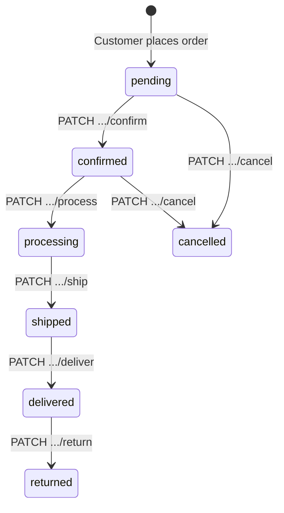

# Rofaar API — Admin Guide

Step-by-step reference for store operators and administrators. Requires an account with role `admin`, `operator`, or `super_admin` (permissions vary by role).

| Environment | Base URL |
|-------------|----------|
| Development | `http://localhost:3000/api/v1` |
| Production  | `https://api.rofaar.com/api/v1` |

---

## Table of contents

1. [Conventions & access control](#1-conventions--access-control)
2. [Admin authentication](#2-admin-authentication)
3. [Dashboard & analytics](#3-dashboard--analytics)
4. [Products](#4-products)
5. [Categories & brands](#5-categories--brands)
6. [Marketing (banners & ads)](#6-marketing-banners--ads)
7. [Inventory](#7-inventory)
8. [Shipping](#8-shipping)
9. [Coupons](#9-coupons)
10. [Orders (fulfillment)](#10-orders-fulfillment)
11. [Payments verification](#11-payments-verification)
12. [Refunds](#12-refunds)
13. [Users](#13-users)
14. [Reviews moderation](#14-reviews-moderation)
15. [Contact submissions](#15-contact-submissions)
16. [Product Q&A](#16-product-qa)
17. [Cart management](#17-cart-management)
18. [Roles & permissions](#18-roles--permissions)
19. [Operational playbook](#19-operational-playbook)

---

## 1. Conventions & access control

### Response format (all routes)

Identical to the [user API](./user-api.md#1-conventions). All handlers use `reply.sendOk()`, `reply.sendCreated()`, or `reply.sendPaginated()` from `src/plugins/response.ts`.

**Success:** `{ "success": true, "message?": "...", "data": ... }`  
**Paginated:** `{ "success": true, "data": [], "pagination": { page, limit, total, totalPages } }`  
**Error:** `{ "success": false, "code": "...", "message": "...", "errors?": {} }`

### Authentication

Every admin route requires:

```http
Authorization: Bearer <access_token>
```

### Authorization layers

| Mechanism | When used |
|-----------|-----------|
| `adminOnly` | Dashboard, inventory, shipping admin — must be `admin` or `super_admin` |
| `requirePermission(action, resource)` | Granular RBAC per route (e.g. `create` + `products`) |
| `super_admin` | Wildcard `manage` + `*` — all permissions |

Operators typically have read/update on orders only; admins have full catalog and promotion access. See [§18 Roles & permissions](#18-roles--permissions).

### Error codes

| HTTP | Code | Typical cause |
|------|------|----------------|
| 401 | `UNAUTHORIZED` | Missing or invalid token |
| 403 | `FORBIDDEN` | Valid token but insufficient permission |
| 404 | `NOT_FOUND` | Resource missing |
| 400 | `BAD_REQUEST` | Business rule violation |
| 409 | `CONFLICT` | Duplicate resource |

---

## 2. Admin authentication

Staff use the same auth module as customers, with a dedicated login endpoint.

### Admin / operator login

```http
POST /auth/admin/login
Content-Type: application/json
```

**Body:**

```json
{
  "phone": "01700000000",
  "password": "adminPassword123"
}
```

Allowed roles: `super_admin`, `admin`, `operator`.

**Response:** `200`

```json
{
  "success": true,
  "data": {
    "token": "<jwt>",
    "refreshToken": "<refresh>",
    "user": {
      "id": "uuid",
      "name": "Store Admin",
      "email": "admin@rofaar.com",
      "role": "admin"
    }
  }
}
```

### Token refresh & profile

Same as customer API:

- `POST /auth/refresh` — Refresh token
- `POST /auth/logout` — Logout
- `GET /auth/me` — Get profile info
- `POST /auth/change-password` — Change password
- `PATCH /auth/profile` — Update name/email

---

## 3. Dashboard & analytics

Prefix: `/admin` (registered at `/api/v1/admin`).

**Guard:** `authenticate` + `adminOnly` on all routes below.

### Summary stats

```http
GET /admin/stats
```

**Response:** `200`

```json
{
  "success": true,
  "data": {
    "totalUsers": 150,
    "totalOrders": 320,
    "totalProducts": 85,
    "totalRevenue": "125000.00"
  }
}
```

---

### Recent orders

```http
GET /admin/recent-orders
```

**Response:** `200` — Array of latest 10 orders with customer names and total amounts.

---

### Sales chart

```http
GET /admin/sales-chart?period=daily&startDate=2026-01-01T00:00:00Z&endDate=2026-05-01T00:00:00Z
```

| Query | Values |
|-------|--------|
| `period` | `daily`, `weekly`, `monthly` (default `daily`) |
| `startDate`, `endDate` | Optional ISO datetimes |

**Response:** `200`

```json
{
  "success": true,
  "data": [
    { "date": "2026-05-20", "revenue": "1500.00", "orders": 5 }
  ]
}
```

---

### Top selling products

```http
GET /admin/top-products?limit=10
```

| Query | Values |
|-------|--------|
| `limit` | Max results (1-50, default 10) |

**Response:** `200`

```json
{
  "success": true,
  "data": [
    { "id": "uuid", "name": "Product Name", "quantitySold": 50, "revenue": "45000.00" }
  ]
}
```

---

## 4. Products

Prefix: `/admin/products`.

| Method | Path | Permission |
|--------|------|------------|
| `GET` | `/` | `read` `products` |
| `POST` | `/create` | `create` `products` |
| `PUT` | `/update/:id` | `update` `products` |
| `DELETE` | `/delete/:id` | `delete` `products` |

### List products

```http
GET /admin/products?page=1&limit=20&search=shirt&isActive=true
```

Returns a paginated list of products, including inactive items. Query params match the public listing plus `isActive=true|false`.

**Response:** `200` — paginated product list.

---

### Create product

```http
POST /admin/products/create
```

**Body:**

```json
{
  "name": "Cotton T-Shirt",
  "slug": "cotton-t-shirt",
  "description": "Soft cotton tee",
  "price": 899,
  "stock": 50,
  "isActive": true,
  "categoryId": "uuid",
  "brandId": "uuid",
  "images": [
    { "url": "https://cdn.example.com/shirt.jpg", "sortOrder": 0 }
  ]
}
```

**Response:** `201`

```json
{
  "success": true,
  "data": {
    "id": "uuid",
    "name": "Cotton T-Shirt",
    "slug": "cotton-t-shirt",
    "description": "Soft cotton tee",
    "price": "899.00",
    "stock": 50,
    "isActive": true,
    "categoryId": "uuid",
    "brandId": "uuid",
    "images": [
      { "url": "https://cdn.example.com/shirt.jpg", "sortOrder": 0 }
    ],
    "createdAt": "2024-01-01T00:00:00.000Z"
  }
}
```

---

### Update product

```http
PUT /admin/products/update/:id
```

`:id` = Product UUID.

**Body:** (Partial update allowed)

```json
{
  "price": 999,
  "stock": 100
}
```

**Response:** `200`

```json
{
  "success": true,
  "data": {
    "id": "uuid",
    "name": "Cotton T-Shirt",
    "slug": "cotton-t-shirt",
    "price": "999.00",
    "stock": 100,
    "isActive": true
    /* ... other fields */
  }
}
```

---

### Delete product

```http
DELETE /admin/products/delete/:id
```

**Response:** `200`
```json
{ "success": true, "message": "Product deleted successfully" }
```

---

## 5. Categories & brands

### Categories

Prefix: `/admin/categories`.

| Method | Path | Permission |
|--------|------|------------|
| `GET` | `/` | `read` `categories` |
| `POST` | `/create` | `create` `categories` |
| `PUT` | `/update/:id` | `update` `categories` |
| `DELETE` | `/delete/:id` | `delete` `categories` |

### List categories

```http
GET /admin/categories
```

**Response:** `200` — array of categories.

---

### Create category

```http
POST /admin/categories/create
```

**Body:**

```json
{
  "name": "Men's Wear",
  "slug": "mens-wear",
  "description": "Clothing for men",
  "imageUrl": "https://cdn.example.com/cat.jpg"
}
```

**Response:** `201`

```json
{
  "success": true,
  "data": {
    "id": "uuid",
    "name": "Men's Wear",
    "slug": "mens-wear",
    "description": "Clothing for men",
    "imageUrl": "https://cdn.example.com/cat.jpg",
    "createdAt": "2024-01-01T00:00:00.000Z"
  }
}
```

---

### Update category

```http
PUT /admin/categories/update/:id
```

`:id` = Category UUID.

**Body:** Partial category fields.

```json
{
  "name": "Men's Clothing"
}
```

**Response:** `200`

```json
{
  "success": true,
  "data": {
    "id": "uuid",
    "name": "Men's Clothing",
    "slug": "mens-wear",
    "description": "Clothing for men",
    "imageUrl": "https://cdn.example.com/cat.jpg",
    "createdAt": "2024-01-01T00:00:00.000Z"
  }
}
```

---

### Delete category

```http
DELETE /admin/categories/delete/:id
```

**Response:** `200`

```json
{ "success": true, "message": "Category deleted successfully" }
```

Public read remains: `GET /categories`, `GET /categories/:slug`.

---

### Brands

Prefix: `/admin/brands`.

| Method | Path | Permission |
|--------|------|------------|
| `GET` | `/` | `read` `brands` |
| `POST` | `/create` | `create` `brands` |
| `PUT` | `/update/:id` | `update` `brands` |
| `DELETE` | `/delete/:id` | `delete` `brands` |

### List brands

```http
GET /admin/brands
```

**Response:** `200` — array of brands.

---

### Create brand

```http
POST /admin/brands/create
```

**Body:**

```json
{
  "name": "Rofaar Basics",
  "slug": "rofaar-basics",
  "description": "House brand",
  "logoUrl": "https://cdn.example.com/logo.png"
}
```

**Response:** `201`

```json
{
  "success": true,
  "data": {
    "id": "uuid",
    "name": "Rofaar Basics",
    "slug": "rofaar-basics",
    "description": "House brand",
    "logoUrl": "https://cdn.example.com/logo.png",
    "createdAt": "2024-01-01T00:00:00.000Z"
  }
}
```

---

### Update brand

```http
PUT /admin/brands/update/:id
```

`:id` = Brand UUID.

**Body:** Partial brand fields.

```json
{
  "description": "Updated house brand"
}
```

**Response:** `200`

```json
{
  "success": true,
  "data": {
    "id": "uuid",
    "name": "Rofaar Basics",
    "slug": "rofaar-basics",
    "description": "Updated house brand",
    "logoUrl": "https://cdn.example.com/logo.png",
    "createdAt": "2024-01-01T00:00:00.000Z"
  }
}
```

---

### Delete brand

```http
DELETE /admin/brands/delete/:id
```

**Response:** `200`

```json
{ "success": true, "message": "Brand deleted successfully" }
```

---

## 6. Marketing (banners & ads)

### Banners — `/admin/banners`

| Method | Path | Permission |
|--------|------|------------|
| `GET` | `/` | `read` `banners` |
| `POST` | `/` | `create` `banners` |
| `PUT` | `/:id` | `update` `banners` |
| `DELETE` | `/:id` | `delete` `banners` |

**Create body:**

```json
{
  "title": "Summer Sale",
  "subtitle": "Up to 50% off",
  "imageUrl": "https://cdn.example.com/banner.jpg",
  "linkUrl": "https://rofaar.com/sale",
  "isActive": true,
  "sortOrder": 0
}
```

**Response (Create/Update):** `200` or `201`
```json
{
  "success": true,
  "data": {
    "id": "uuid",
    "title": "Summer Sale",
    "subtitle": "Up to 50% off",
    "imageUrl": "https://cdn.example.com/banner.jpg",
    "linkUrl": "https://rofaar.com/sale",
    "isActive": true,
    "sortOrder": 0
  }
}
```

---

### Advertisements — `/admin/advertisements`

| Method | Path | Permission |
|--------|------|------------|
| `GET` | `/` | `read` `advertisements` |
| `POST` | `/` | `create` `advertisements` |
| `PUT` | `/:id` | `update` `advertisements` |
| `DELETE` | `/:id` | `delete` `advertisements` |

**Create body:**

```json
{
  "title": "Hero Promo",
  "imageUrl": "https://cdn.example.com/ad.jpg",
  "linkUrl": "https://rofaar.com/promo",
  "position": "homepage",
  "isActive": true
}
```

**Response (Create/Update):** `200` or `201`
```json
{
  "success": true,
  "data": {
    "id": "uuid",
    "title": "Hero Promo",
    "imageUrl": "https://cdn.example.com/ad.jpg",
    "linkUrl": "https://rofaar.com/promo",
    "position": "homepage",
    "isActive": true
  }
}
```

---

## 7. Inventory

Prefix: `/admin/inventory`.

**Guard:** `authenticate` + `adminOnly`.

### Adjust stock

```http
POST /admin/inventory/adjust
```

**Body:**

```json
{
  "productId": "uuid",
  "quantityChange": 10,
  "type": "stock_increase",
  "note": "Restock from supplier"
}
```

| `type` | Use case |
|--------|----------|
| `stock_increase` | Manual add |
| `stock_decrease` | Manual remove |
| `manual_adjustment` | Correction |

**Response:** `200`

```json
{
  "success": true,
  "data": {
    "id": "uuid",
    "productId": "uuid",
    "type": "stock_increase",
    "quantityChange": 10,
    "stockAfter": 60,
    "note": "Restock from supplier",
    "createdAt": "2024-01-01T00:00:00.000Z"
  }
}
```

---

### Inventory logs

```http
GET /admin/inventory/logs?productId=<uuid>
```

`productId` optional — filter by product.

**Response:** `200`

```json
{
  "success": true,
  "data": [
    {
      "id": "uuid",
      "productId": "uuid",
      "type": "order_deduction",
      "quantityChange": -2,
      "stockAfter": 58,
      "note": "Order #123",
      "createdAt": "2024-01-01T00:00:00.000Z"
    }
  ]
}
```

---

### Low stock alert

```http
GET /admin/inventory/low-stock
```

**Response:** `200`

```json
{
  "success": true,
  "data": [
    {
      "id": "uuid",
      "name": "Cotton T-Shirt",
      "stock": 5
    }
  ]
}
```

---

## 8. Shipping

### Admin CRUD — `/admin/shipping`

**Guard:** `authenticate` + `adminOnly`.

#### Zones

| Method | Path | Body |
|--------|------|------|
| `POST` | `/zones` | `{ "name": "Dhaka", "description": "Inside Dhaka city" }` |
| `PUT` | `/zones/:id` | Partial zone fields |
| `DELETE` | `/zones/:id` | — |

**Response (Create/Update Zone):** `200` or `201`
```json
{
  "success": true,
  "data": {
    "id": "uuid",
    "name": "Dhaka",
    "description": "Inside Dhaka city",
    "isActive": true
  }
}
```

#### Methods

| Method | Path | Body |
|--------|------|------|
| `POST` | `/methods` | See below |
| `PUT` | `/methods/:id` | Partial method fields |
| `DELETE` | `/methods/:id` | — |

**Create method body:**

```json
{
  "zoneId": "uuid",
  "name": "Standard Delivery",
  "cost": 80,
  "estimatedDays": "2-3 days"
}
```

**Response (Create/Update Method):** `200` or `201`
```json
{
  "success": true,
  "data": {
    "id": "uuid",
    "zoneId": "uuid",
    "name": "Standard Delivery",
    "cost": "80.00",
    "estimatedDays": "2-3 days",
    "isActive": true
  }
}
```

---

## 9. Coupons

Prefix: `/admin/coupons`.

| Method | Path | Permission |
|--------|------|------------|
| `GET` | `/` | `read` `coupons` |
| `POST` | `/` | `create` `coupons` |
| `PUT` | `/:id` | `update` `coupons` |
| `DELETE` | `/:id` | `delete` `coupons` |

**Create body:**

```json
{
  "code": "RAMADAN10",
  "description": "10% off Ramadan sale",
  "discountType": "percentage",
  "discountValue": 10,
  "minOrderAmount": 1000,
  "maxUsageCount": 500,
  "isActive": true,
  "expiresAt": "2026-04-30T23:59:59Z"
}
```

**Response (Create/Update):** `200` or `201`
```json
{
  "success": true,
  "data": {
    "id": "uuid",
    "code": "RAMADAN10",
    "discountType": "percentage",
    "discountValue": "10.00",
    "minOrderAmount": "1000.00",
    "usageCount": 0,
    "isActive": true,
    "expiresAt": "2026-04-30T23:59:59.000Z"
  }
}
```

| `discountType` | `discountValue` meaning |
|----------------|-------------------------|
| `percentage` | Percent off subtotal |
| `fixed` | Fixed amount off subtotal |

Customers validate via `POST /coupons/validate` before checkout.

---

## 10. Orders (fulfillment)

Prefix: `/admin/orders`.

**Guard:** `authenticate` on register; per-route `requirePermission`.

### List orders

```http
GET /admin/orders?page=1&limit=20&status=pending&userId=<uuid>
```

**Permission:** `read` `orders`

**Response:** `200`
```json
{
  "success": true,
  "data": [
    {
      "id": "uuid",
      "status": "pending",
      "totalAmount": "1500.00",
      "user": { "name": "Roky Ahmed" },
      "createdAt": "..."
    }
  ],
  "pagination": { "page": 1, "limit": 20, "total": 1, "totalPages": 1 }
}
```

---

### Orders by user

```http
GET /admin/orders/user/:id
```

`:id` = customer user UUID.

**Response:** `200` — Array of orders (same shape as list above).

---

### Order detail

```http
GET /admin/orders/:id
```

Includes user, items with products, address, coupon.

**Response:** `200`
```json
{
  "success": true,
  "data": {
    "id": "uuid",
    "status": "pending",
    "totalAmount": "1500.00",
    "items": [
      { "productId": "uuid", "quantity": 2, "priceAtAdd": "750.00", "product": { "name": "..." } }
    ],
    "address": { "recipientName": "...", "addressLine": "..." },
    "coupon": { "code": "..." }
  }
}
```

---

### Update status (generic)

```http
PATCH /admin/orders/:id/status
```

**Body:**

```json
{
  "status": "processing"
}
```

Allowed: `pending`, `confirmed`, `processing", `shipped`, `delivered`, `cancelled`, `returned`.

**Permission:** `update` `orders`

**Response:** `200" — Updated order object (same shape as detail).

---

### Lifecycle shortcuts

Prefer these for the standard flow — they enforce valid transitions and write order history.

| Step | Method | Path | Body |
|------|--------|------|------|
| 1. Confirm | `PATCH` | `/admin/orders/:id/confirm` | — |
| 2. Process | `PATCH` | `/admin/orders/:id/process` | — |
| 3. Ship | `PATCH` | `/admin/orders/:id/ship` | `{ "trackingNumber": "...", "trackingUrl": "..." }` |
| 4. Deliver | `PATCH` | `/admin/orders/:id/deliver` | — |
| Mark paid | `PATCH` | `/admin/orders/:id/mark-paid` | — |
| Return | `PATCH` | `/admin/orders/:id/return` | — |
| Cancel | `PATCH` | `/admin/orders/:id/cancel` | `{ "reason": "...", "comment": "..." }` |

**Response (All shortcuts):** `200` — Updated order object.

---

### Payment status

```http
PATCH /admin/orders/:id/payment-status
```

**Body:**

```json
{
  "paymentStatus": "paid"
}
```

Values: `unpaid`, `paid", `partial`, `failed`, `refunded`.

**Response:** `200` — Updated order object.

---

### Cancel request actions

```http
PATCH /admin/orders/:id/cancel-request/approve
PATCH /admin/orders/:id/cancel-request/reject
```

**Body:** `{ "reason": "...", "comment": "..." }`

**Response:** `200`
```json
{
  "success": true,
  "message": "Order cancel request approved",
  "data": { "id": "uuid", "status": "cancelled" }
}
```

---

### Delete order

```http
DELETE /admin/orders/:id
```

**Permission:** `delete` `orders`

**Response:** `200` — `{ "success": true }`

---

### Order fulfillment flow



---

## 11. Payments verification

There is no separate admin payment API. For **on_air** (bKash/Nagad) orders:

1. Customer submits: `POST /orders/:id/pay` with `transactionId` and `phoneNumber`
2. Admin reviews payment records: `GET /orders/:id` (customer endpoint) or order detail in admin
3. Admin confirms: `PATCH /admin/orders/:id/mark-paid` or `PATCH .../payment-status` with `"paid"`

**COD orders:** No customer payment step; mark `paid` on delivery if needed.

---

## 12. Refunds

Prefix: `/admin/refunds`.

| Method | Path | Permission | Response |
|--------|------|------------|----------|
| `GET` | `/` | `read` `orders` | `200` — Array of all refund requests |
| `PATCH` | `/:id/approve` | `update` `orders` | `200` — Approved refund object |
| `PATCH` | `/:id/reject` | `update` `orders` | `200` — Rejected refund object |

### List refund requests

```http
GET /admin/refunds
```

Includes linked order and user.

**Response:** `200`
```json
{
  "success": true,
  "data": [
    {
      "id": "uuid",
      "orderId": "uuid",
      "status": "requested",
      "reason": "Damaged product",
      "user": { "name": "Roky Ahmed" }
    }
  ]
}
```

---

### Approve

```http
PATCH /admin/refunds/:id/approve
```

**Body:**

```json
{
  "adminNote": "Refund approved, amount sent"
}
```

Sets order status to `returned` and payment status to `refunded`.

**Response:** `200`
```json
{
  "success": true,
  "data": { "id": "uuid", "status": "approved", "adminNote": "..." }
}
```

---

### Reject

```http
PATCH /admin/refunds/:id/reject
```

**Body:**

```json
{
  "adminNote": "Item shows normal wear — not eligible"
}
```

`adminNote` required (min 5 characters).

**Response:** `200`
```json
{
  "success": true,
  "data": { "id": "uuid", "status": "rejected", "adminNote": "..." }
}
```

---

## 13. Users

Prefix: `/admin/users`.

```http
GET /admin/users
```

**Permission:** `read` `users`

**Response:** `200`
```json
{
  "success": true,
  "data": [
    {
      "id": "uuid",
      "name": "Roky Ahmed",
      "phone": "01712345678",
      "role": "customer",
      "createdAt": "..."
    }
  ]
}
```

---

## 14. Reviews moderation

Prefix: `/admin/reviews`.

| Method | Path | Permission |
|--------|------|------------|
| `GET` | `/` | `read` `reviews` |
| `DELETE` | `/:id` | `delete` `reviews` |

**Response (List):** `200`
```json
{
  "success": true,
  "data": [
    {
      "id": "uuid",
      "rating": 5,
      "comment": "...",
      "product": { "name": "..." },
      "user": { "name": "..." }
    }
  ]
}
```

---

## 15. Contact submissions

Prefix: `/admin/contacts`.

| Method | Path | Permission |
|--------|------|------------|
| `GET` | `/` | `read` `contacts` |
| `PATCH` | `/:id/status` | `update` `contacts` |
| `DELETE` | `/:id` | `delete` `contacts` |

**Update status body:**

```json
{
  "status": "resolved"
}
```

**Response (List):** `200`
```json
{
  "success": true,
  "data": [
    {
      "id": "uuid",
      "name": "Roky",
      "subject": "Help",
      "message": "...",
      "status": "pending"
    }
  ]
}
```

---

## 16. Product Q&A

Customers ask via `POST /qa/questions`. Admins answer officially:

```http
POST /admin/qa/answers
Authorization: Bearer <token>
```

**Permission:** `update` `products`

**Body:**

```json
{
  "questionId": "uuid",
  "answer": "Yes, size XL is in stock."
}
```

**Response:** `201`
```json
{
  "success": true,
  "data": {
    "id": "uuid",
    "questionId": "uuid",
    "answer": "Yes, size XL is in stock.",
    "isOfficial": true
  }
}
```

---

## 17. Cart management

Prefix: `/admin/cart`.

Support tool to inspect or fix a customer's cart.

| Method | Path | Permission |
|--------|------|------------|
| `GET` | `/user/:id` | `read` `orders` |
| `DELETE` | `/user/:id` | `update` `orders` |
| `PUT` | `/user/:userId/update/:id` | `update` `orders` |

`:id` on update = cart line item UUID.

**Update body:**

```json
{
  "quantity": 2
}
```

**Response (Get Cart):** `200` — Array of cart items (same shape as customer cart).

---

## 18. Roles & permissions

Seed script: `npx tsx src/db/seed.ts`

| Role | Typical access |
|------|----------------|
| `super_admin` | Everything (`manage` + `*`) |
| `admin` | Full catalog, orders, coupons, users, contacts, reviews |
| `operator` | Read/update orders, read products/categories/reviews |
| `customer` | Storefront only (not admin routes) |

### Admin permission matrix

| Resource | Actions (admin role) |
|----------|----------------------|
| `products` | create, read, update, delete |
| `categories` | create, read, update, delete |
| `brands` | create, read, update, delete |
| `banners` | create, read, update, delete |
| `advertisements` | create, read, update, delete |
| `orders` | read, update |
| `coupons` | create, read, update, delete |
| `reviews` | read, update, delete |
| `users` | read, update |
| `contacts` | read, update, delete |

Routes using `adminOnly` (dashboard, inventory, shipping) require `admin` or `super_admin` role name — operators cannot access these unless promoted.

---

## 19. Operational playbook

### New order (COD)

1. `GET /admin/orders?status=pending` — review new orders
2. `PATCH /admin/orders/:id/confirm`
3. `PATCH /admin/orders/:id/process`
4. `PATCH /admin/orders/:id/ship` — add tracking
5. `PATCH /admin/orders/:id/deliver`

### New order (on_air / bKash)

1. Steps 1–2 above
2. Wait for customer `POST /orders/:id/pay`
3. Verify transaction ID manually
4. `PATCH /admin/orders/:id/mark-paid`
5. Continue process → ship → deliver

### Low stock

1. `GET /admin/inventory/low-stock`
2. `POST /admin/inventory/adjust` — restock
3. Optionally `PUT /admin/products/update/:id` — update `stock` field

### Refund request

1. `GET /admin/refunds`
2. Review order via `GET /admin/orders/:id`
3. `PATCH /admin/refunds/:id/approve` or `reject`

### Daily dashboard check

1. `GET /admin/stats`
2. `GET /admin/recent-orders`
3. `GET /admin/sales-chart?period=daily`
4. `GET /admin/top-products?limit=5`

---

## Quick reference — all admin endpoints

| Area | Method | Path |
|------|--------|------|
| Auth | POST | `/auth/admin/login` |
| Dashboard | GET | `/admin/stats` |
| Dashboard | GET | `/admin/recent-orders` |
| Dashboard | GET | `/admin/sales-chart` |
| Dashboard | GET | `/admin/top-products` |
| Products | GET/POST/PUT/DELETE | `/admin/products/...` |
| Categories | GET/POST/PUT/DELETE | `/admin/categories/...` |
| Brands | GET/POST/PUT/DELETE | `/admin/brands/...` |
| Banners | GET/POST/PUT/DELETE | `/admin/banners/...` |
| Ads | GET/POST/PUT/DELETE | `/admin/advertisements/...` |
| Inventory | POST/GET | `/admin/inventory/adjust`, `/logs`, `/low-stock` |
| Shipping | POST/PUT/DELETE | `/admin/shipping/zones`, `/methods` |
| Coupons | GET/POST/PUT/DELETE | `/admin/coupons/...` |
| Orders | GET/PATCH/DELETE | `/admin/orders/...` |
| Refunds | GET/PATCH | `/admin/refunds/...` |
| Users | GET | `/admin/users` |
| Reviews | GET/DELETE | `/admin/reviews/...` |
| Contacts | GET/PATCH/DELETE | `/admin/contacts/...` |
| Q&A | POST | `/admin/qa/answers` |
| Cart | GET/DELETE/PUT | `/admin/cart/user/...` |

---

*Last updated to match the current `rofaar-backend` route implementation.*
