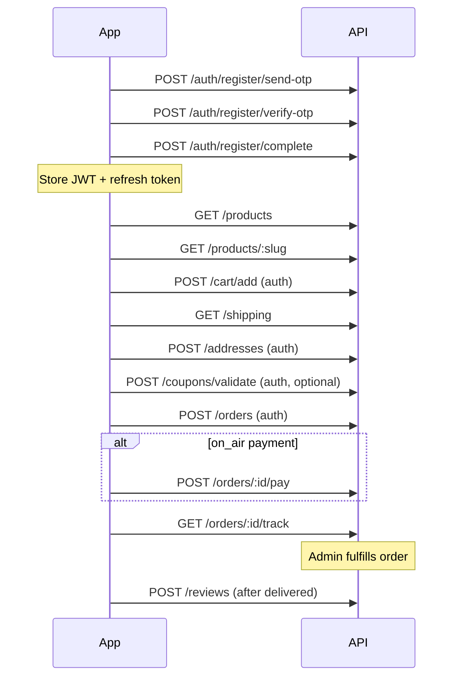

# Rofaar API — User (Customer) Guide

Step-by-step reference for customer-facing endpoints. All paths are relative to the API base URL.

| Environment | Base URL |
|-------------|----------|
| Development | `http://localhost:3000/api/v1` |
| Production  | `https://api.rofaar.com/api/v1` |

Interactive docs (when enabled): `http://localhost:3000/documentation`

---

## Table of contents

1. [Conventions](#1-conventions)
2. [Authentication](#2-authentication)
3. [Browse catalog](#3-browse-catalog)
4. [Cart](#4-cart)
5. [Wishlist](#5-wishlist)
6. [Shipping addresses](#6-shipping-addresses)
7. [Checkout & orders](#7-checkout--orders)
8. [Payments (on-air)](#8-payments-on-air)
9. [Reviews](#9-reviews)
10. [Product Q&A](#10-product-qa)
11. [Refunds](#11-refunds)
12. [Contact](#12-contact)
13. [Profile](#13-profile)
14. [Recommended client flow](#14-recommended-client-flow)

---

## 1. Conventions

### Response format (all routes)

Every API route uses the same envelope. Helpers live in `src/shared/response.ts`; route handlers use `reply.sendOk()`, `reply.sendCreated()`, and `reply.sendPaginated()`.

**Success (single resource) — HTTP 200 or 201:**

```json
{
  "success": true,
  "message": "Optional human-readable message",
  "data": { }
}
```

**Success (paginated list) — HTTP 200:**

```json
{
  "success": true,
  "data": [ ],
  "pagination": {
    "page": 1,
    "limit": 10,
    "total": 42,
    "totalPages": 5
  }
}
```

**Error — HTTP 4xx / 5xx:**

```json
{
  "success": false,
  "code": "BAD_REQUEST",
  "message": "Cart is empty"
}
```

**Validation error — HTTP 400:**

```json
{
  "success": false,
  "code": "VALIDATION_ERROR",
  "message": "Validation failed",
  "errors": {
    "phone": ["String must contain at least 10 character(s)"]
  }
}
```

| HTTP | Typical `code` |
|------|----------------|
| 400 | `BAD_REQUEST`, `VALIDATION_ERROR` |
| 401 | `UNAUTHORIZED` |
| 403 | `FORBIDDEN` |
| 404 | `NOT_FOUND` |
| 409 | `CONFLICT` |
| 500 | `INTERNAL_SERVER_ERROR` |

### Authentication header

Protected routes require:

```http
Authorization: Bearer <access_token>
```

Access tokens are JWTs returned from login or registration. Use the refresh token to obtain a new access token before expiry.

### IDs

Unless noted otherwise, `id` fields are UUIDs.

---

## 2. Authentication

Customer auth lives under `/auth`. No token is required until you reach protected profile routes.

### Step 1 — Request registration OTP

```http
POST /auth/register/send-otp
Content-Type: application/json
```

**Body:**

```json
{
  "phone": "01712345678"
}
```

**Response:** `200`

```json
{
  "success": true,
  "message": "OTP sent successfully",
  "data": null
}
```

(In development, OTP is logged on the server console).

**Errors:** `409` if the phone is already fully registered.

---

### Step 2 — Verify OTP

```http
POST /auth/register/verify-otp
```

**Body:**

```json
{
  "phone": "01712345678",
  "otp": "123456"
}
```

**Response:** `200`

```json
{
  "success": true,
  "data": {
    "token": "<registration_token>"
  }
}
```

Save `token` for the next step. It expires in 30 minutes.

---

### Step 3 — Complete registration

```http
POST /auth/register/complete
```

**Body:**

```json
{
  "token": "<registration_token>",
  "name": "Roky Ahmed",
  "email": "roky@example.com",
  "password": "securePass123"
}
```

**Response:** `201`

```json
{
  "success": true,
  "data": {
    "token": "<jwt_access_token>",
    "refreshToken": "<refresh_token>",
    "user": {
      "id": "uuid",
      "name": "Roky Ahmed",
      "email": "roky@example.com",
      "role": "customer"
    }
  }
}
```

Store both `token` and `refreshToken` securely.

---

### Login (existing customer)

```http
POST /auth/login
```

**Body:**

```json
{
  "phone": "01712345678",
  "password": "securePass123"
}
```

**Response:** `200`

```json
{
  "success": true,
  "data": {
    "token": "<jwt_access_token>",
    "refreshToken": "<refresh_token>",
    "user": {
      "id": "uuid",
      "name": "Roky Ahmed",
      "email": "roky@example.com",
      "role": "customer"
    }
  }
}
```

---

### Refresh access token

```http
POST /auth/refresh
```

**Body:**

```json
{
  "refreshToken": "<refresh_token>"
}
```

**Response:** `200`

```json
{
  "success": true,
  "data": {
    "token": "<new_access_token>",
    "refreshToken": "<new_refresh_token>"
  }
}
```

---

### Logout

```http
POST /auth/logout
```

**Body:**

```json
{
  "refreshToken": "<refresh_token>"
}
```

**Response:** `200`

```json
{
  "success": true,
  "message": "Logged out successfully",
  "data": null
}
```

---

### Forgot password

**Step A — Request OTP**

```http
POST /auth/forgot-password
```

**Body:**
```json
{ "phone": "01712345678" }
```

**Response:** `200`
```json
{
  "success": true,
  "message": "If an account exists, a password reset OTP has been sent.",
  "data": null
}
```

**Step B — Verify OTP**

```http
POST /auth/verify-otp
```

**Body:**
```json
{
  "phone": "01712345678",
  "otp": "123456"
}
```

**Response:** `200`
```json
{
  "success": true,
  "data": { "resetToken": "..." }
}
```

**Step C — Reset password**

```http
POST /auth/reset-password
```

**Body:**
```json
{
  "resetToken": "<reset_token>",
  "newPassword": "newSecurePass123"
}
```

**Response:** `200`
```json
{
  "success": true,
  "message": "Password has been reset successfully.",
  "data": null
}
```

---

### Protected profile routes

Requires `Authorization: Bearer <token>`.

#### Get profile
```http
GET /auth/me
```

**Response:** `200`
```json
{
  "success": true,
  "data": {
    "id": "uuid",
    "name": "Roky Ahmed",
    "email": "roky@example.com",
    "role": "customer",
    "isVerified": true,
    "createdAt": "2024-01-01T00:00:00.000Z"
  }
}
```

#### Change password
```http
POST /auth/change-password
```

**Body:**
```json
{
  "oldPassword": "securePass123",
  "newPassword": "newSecurePass456"
}
```

**Response:** `200`
```json
{
  "success": true,
  "message": "Password changed successfully.",
  "data": null
}
```

#### Update profile
```http
PATCH /auth/profile
```

**Body:**
```json
{
  "name": "New Name",
  "email": "new@example.com"
}
```

**Response:** `200`
```json
{
  "success": true,
  "message": "Profile updated successfully.",
  "data": null
}
```

---

## 3. Browse catalog

These endpoints are public (no auth required).

### List products

```http
GET /products?page=1&limit=10&search=shirt&category=<uuid>&brand=<uuid>&minPrice=100&maxPrice=5000&sort=newest
```

| Query | Values |
|-------|--------|
| `page`, `limit` | Pagination (default 1, 10; max limit 100) |
| `search` | Name search |
| `category`, `brand` | Filter by UUID |
| `minPrice`, `maxPrice` | Price range |
| `sort` | `newest`, `price-low`, `price-high`, `popular` |

**Response:** `200`

```json
{
  "success": true,
  "data": [
    {
      "id": "uuid",
      "name": "Cotton T-Shirt",
      "slug": "cotton-t-shirt-blue",
      "description": "Premium cotton t-shirt",
      "price": "500.00",
      "stock": 100,
      "isActive": true,
      "category": { "id": "uuid", "name": "Clothing" },
      "brand": { "id": "uuid", "name": "BrandName" },
      "images": [
        { "url": "https://example.com/image.jpg", "sortOrder": 0 }
      ]
    }
  ],
  "pagination": {
    "page": 1,
    "limit": 10,
    "total": 42,
    "totalPages": 5
  }
}
```

---

### Product detail (by slug)

```http
GET /products/:slug
```

Example: `GET /products/cotton-t-shirt-blue`

**Response:** `200`

```json
{
  "success": true,
  "data": {
    "id": "uuid",
    "name": "Cotton T-Shirt",
    "slug": "cotton-t-shirt-blue",
    "description": "Premium cotton t-shirt",
    "price": "500.00",
    "stock": 100,
    "isActive": true,
    "category": { "id": "uuid", "name": "Clothing" },
    "brand": { "id": "uuid", "name": "BrandName" },
    "images": [
      { "url": "https://example.com/image.jpg", "sortOrder": 0 }
    ]
  }
}
```

Viewing a product logs it for recently-viewed recommendations (when logged in later).

---

### Related products

```http
GET /products/:id/related
```

`:id` is the product **UUID** (not slug).

**Response:** `200` — Array of products (same shape as product detail).

---

### Recently viewed (auth required)

```http
GET /products/recently-viewed
Authorization: Bearer <token>
```

**Response:** `200` — Array of up to 10 products.

---

### Categories

```http
GET /categories
```

**Response:** `200`

```json
{
  "success": true,
  "data": [
    {
      "id": "uuid",
      "name": "Clothing",
      "slug": "clothing",
      "description": "Apparel and more",
      "imageUrl": "https://example.com/cat.jpg"
    }
  ]
}
```

```http
GET /categories/:slug
```

**Response:** `200` — Single category object.

---

### Brands

```http
GET /brands
```

**Response:** `200`

```json
{
  "success": true,
  "data": [
    {
      "id": "uuid",
      "name": "BrandName",
      "slug": "brand-name",
      "description": "Top quality brand",
      "logoUrl": "https://example.com/logo.png"
    }
  ]
}
```

```http
GET /brands/:slug
```

**Response:** `200` — Single brand object.

---

### Search

```http
GET /search/autocomplete?q=shirt
```

Returns up to 5 matches (`id`, `name`, `slug`).

**Response:** `200`

```json
{
  "success": true,
  "data": [
    { "id": "uuid", "name": "Cotton Shirt", "slug": "cotton-shirt" }
  ]
}
```

```http
GET /search?q=shirt&minPrice=0&maxPrice=5000&categoryId=<uuid>&brandId=<uuid>&sortBy=newest&page=1&limit=20
```

| `sortBy` | Description |
|----------|-------------|
| `newest` | Default |
| `price_asc` | Lowest price first |
| `price_desc` | Highest price first |
| `popular` | Newest fallback |

**Response:** `200`

```json
{
  "success": true,
  "data": {
    "data": [ /* products */ ],
    "meta": {
      "total": 100,
      "page": 1,
      "limit": 20,
      "totalPages": 5
    }
  }
}
```

---

### Banners & advertisements

```http
GET /banners
GET /advertisements?position=homepage
```

Only active items are returned.

---

## 4. Cart

All cart routes require authentication.

### Get cart

```http
GET /cart/list
Authorization: Bearer <token>
```

**Response:** `200`

```json
{
  "success": true,
  "data": [
    {
      "id": "uuid",
      "productId": "uuid",
      "quantity": 2,
      "priceAtAdd": "500.00",
      "product": {
        "name": "Cotton T-Shirt",
        "slug": "cotton-t-shirt-blue",
        "images": [ { "url": "..." } ]
      }
    }
  ]
}
```

Returns line items with product details and prices captured at add time.

---

### Add item

```http
POST /cart/add
```

**Body:**

```json
{
  "productId": "uuid",
  "quantity": 2
}
```

**Response:** `201`

```json
{
  "success": true,
  "data": {
    "id": "uuid",
    "productId": "uuid",
    "quantity": 2,
    "priceAtAdd": "500.00"
  }
}
```

**Errors:** `404` product not found; `400` insufficient stock.

---

### Update quantity

```http
PUT /cart/update/:id
```

`:id` = cart line item UUID.

**Body:**

```json
{
  "quantity": 3
}
```

**Response:** `200` — Updated cart line item.

---

### Remove item

```http
DELETE /cart/remove/:id
```

**Response:** `200`
```json
{ "success": true, "message": "Item removed from cart" }
```

---

### Clear cart

```http
DELETE /cart/clear
```

**Response:** `200`
```json
{ "success": true, "message": "Cart cleared" }
```

---

## 5. Wishlist

Requires authentication.

| Method | Path | Body / notes | Response |
|--------|------|----------------|----------|
| `GET` | `/wishlist/list` | List wishlist items | Array of wishlist items with product details |
| `POST` | `/wishlist/add` | `{ "productId": "uuid" }` | Created wishlist item |
| `DELETE` | `/wishlist/remove/:id` | `:id` = wishlist item UUID | `{ "success": true }` |
| `POST` | `/wishlist/move/:id` | Move one item to cart | `{ "success": true }` |
| `POST` | `/wishlist/move/all` | Move all items to cart | `{ "success": true }` |

Stock is checked when moving to cart.

---

## 6. Shipping addresses

Requires authentication. Prefix: `/addresses`.

#### List addresses
```http
GET /addresses
```

**Response:** `200`
```json
{
  "success": true,
  "data": [
    {
      "id": "uuid",
      "label": "Home",
      "recipientName": "Roky Ahmed",
      "phone": "01712345678",
      "addressLine": "123 Main Road",
      "city": "Dhaka",
      "district": "Dhaka",
      "postalCode": "1200",
      "isDefault": true
    }
  ]
}
```

#### Create address
```http
POST /addresses
```

**Body:**
```json
{
  "label": "Home",
  "recipientName": "Roky Ahmed",
  "phone": "01712345678",
  "addressLine": "123 Main Road",
  "city": "Dhaka",
  "district": "Dhaka",
  "postalCode": "1200",
  "isDefault": true
}
```

**Response:** `201` — Created address object.

#### Update address
```http
PUT /addresses/:id
```

**Body:** (Partial update allowed)
```json
{ "label": "Office" }
```

**Response:** `200` — Updated address object.

#### Delete address
```http
DELETE /addresses/:id
```

**Response:** `200`
```json
{ "success": true, "message": "Address deleted" }
```

---

## 7. Checkout & orders

### Step 1 — Get shipping options (public)

```http
GET /shipping
```

**Response:** `200`

```json
{
  "success": true,
  "data": [
    {
      "id": "uuid",
      "name": "Inside Dhaka",
      "description": "Delivery within Dhaka city",
      "methods": [
        {
          "id": "uuid",
          "name": "Standard Delivery",
          "cost": "60.00",
          "estimatedDays": "2-3 days"
        }
      ]
    }
  ]
}
```

Returns zones with nested shipping methods and costs. Pick a `shippingMethodId` for checkout.

---

### Step 2 — Validate coupon (optional, auth)

```http
POST /coupons/validate
Authorization: Bearer <token>
```

**Body:**

```json
{
  "code": "RAMADAN10",
  "orderAmount": 5000
}
```

**Response:** `200`

```json
{
  "success": true,
  "data": {
    "code": "RAMADAN10",
    "discountType": "percentage",
    "discountValue": "10.00",
    "discountAmount": 500
  }
}
```

---

### Step 3 — Place order

```http
POST /orders
Authorization: Bearer <token>
```

**Body:**

```json
{
  "addressId": "uuid",
  "paymentMethod": "cod",
  "shippingMethodId": "uuid",
  "couponCode": "RAMADAN10"
}
```

| Field | Values |
|-------|--------|
| `paymentMethod` | `cod` (cash on delivery) or `on_air` (bKash/Nagad — pay after order) |
| `couponCode` | Optional |

**Response:** `201`

```json
{
  "success": true,
  "message": "Order placed successfully",
  "data": {
    "orderId": "uuid"
  }
}
```

Initial order status: **`pending`**. Payment status: **`unpaid`**.

---

### List my orders

```http
GET /orders
Authorization: Bearer <token>
```

**Response:** `200` — Array of orders with items summary.

---

### Order detail

```http
GET /orders/:id
Authorization: Bearer <token>
```

**Response:** `200` — Full order details including items, address, and coupon.

---

### Track order

```http
GET /orders/:id/track
Authorization: Bearer <token>
```

**Response:** `200`

```json
{
  "success": true,
  "data": {
    "orderId": "uuid",
    "status": "processing",
    "history": [
      { "status": "pending", "createdAt": "..." },
      { "status": "confirmed", "createdAt": "..." },
      { "status": "processing", "createdAt": "..." }
    ]
  }
}
```

---

### Cancel order

```http
PATCH /orders/:id/cancel
Authorization: Bearer <token>
```

**Response:** `200`
```json
{ "success": true, "message": "Order cancelled successfully" }
```

Only allowed for certain statuses (e.g. before shipment).

---

### Order & payment status reference

| Order status | Meaning |
|--------------|---------|
| `pending` | Just placed |
| `confirmed` | Accepted by store |
| `processing` | Being prepared |
| `shipped` | In transit |
| `delivered` | Received by customer |
| `cancelled` | Cancelled |
| `returned` | Returned after delivery |

| Payment status | Meaning |
|----------------|---------|
| `unpaid` | Not paid |
| `paid` | Paid |
| `partial` | Partially paid |
| `failed` | Payment failed |
| `refunded` | Refunded |

---

## 8. Payments (on-air)

For orders with `paymentMethod: "on_air"`, submit mobile banking details after placing the order. Admin verifies and marks the order paid.

### Submit payment

```http
POST /orders/:id/pay
Authorization: Bearer <token>
```

**Body:**

```json
{
  "transactionId": "BKASH8X7Y6Z",
  "phoneNumber": "01712345678"
}
```

**Response:** `201`

```json
{
  "success": true,
  "message": "Payment details submitted for verification",
  "data": {
    "transactionId": "BKASH8X7Y6Z"
  }
}
```

**Errors:** Wrong payment method, already paid, or invalid order status.

---

### List payments for order

```http
GET /orders/:id/payment
Authorization: Bearer <token>
```

**Response:** `200` — Array of payment submissions for the order.

---

## 9. Reviews

### List reviews (public)

```http
GET /products/:id/reviews
```

`:id` = product UUID.

**Response:** `200`

```json
{
  "success": true,
  "data": {
    "reviews": [
      {
        "id": "uuid",
        "rating": 5,
        "comment": "Great!",
        "user": { "name": "Roky" },
        "createdAt": "..."
      }
    ],
    "stats": {
      "averageRating": "4.5",
      "totalReviews": 12
    }
  }
}
```

---

### Mark review helpful (public)

```http
POST /reviews/:id/helpful
```

`:id` = review UUID.

**Response:** `200`
```json
{ "success": true, "message": "Marked as helpful" }
```

---

### Write a review (auth)

Requires a **delivered** order containing the product (verified purchase badge).

```http
POST /reviews
Authorization: Bearer <token>
```

**Body:**

```json
{
  "productId": "uuid",
  "rating": 5,
  "comment": "Great quality!"
}
```

**Response:** `201` — Created review object.

`rating`: integer 1–5. One review per user per product.

---

### Update / delete own review

```http
PUT /reviews/:id
DELETE /reviews/:id
Authorization: Bearer <token>
```

---

## 10. Product Q&A

### List questions (public)

```http
GET /products/:id/questions
```

**Response:** `200` — Array of questions with nested answers.

---

### Ask a question (auth)

```http
POST /qa/questions
Authorization: Bearer <token>
```

**Body:**

```json
{
  "productId": "uuid",
  "question": "Is this available in size XL?"
}
```

**Response:** `201` — Created question object.

Answers are posted by admins via the admin API.

---

## 11. Refunds

Only for **delivered** orders.

### Request refund

```http
POST /refunds/request
Authorization: Bearer <token>
```

**Body:**

```json
{
  "orderId": "uuid",
  "reason": "Product damaged on arrival"
}
```

**Response:** `201` — Created refund request object.

`reason`: minimum 10 characters.

---

### List my refunds

```http
GET /refunds
Authorization: Bearer <token>
```

**Response:** `200` — Array of user's refund requests.

Refund statuses: `requested`, `approved`, `rejected`.

---

## 12. Contact

Public — no auth.

```http
POST /contact
```

**Body:**

```json
{
  "name": "Roky Ahmed",
  "email": "roky@example.com",
  "phone": "01712345678",
  "subject": "Order issue",
  "message": "I need help with order #123"
}
```

**Response:** `201`
```json
{ "success": true, "message": "Contact message sent successfully" }
```

---

## 13. Profile

Alternative to `/auth/profile` — user module endpoints.

```http
PATCH /users/profile
DELETE /users/account
Authorization: Bearer <token>
```

**Profile update body:** `name`, `email`, `avatar` (optional fields).

**Response:** `200` — Updated user profile.

**Delete account:** permanently removes the user account.

---

## 14. Recommended client flow



### Checklist before checkout

- [ ] User logged in
- [ ] Cart has items with sufficient stock
- [ ] At least one shipping address
- [ ] Shipping method selected from `GET /shipping`
- [ ] Coupon validated (optional)
- [ ] Payment method chosen (`cod` or `on_air`)

---

*Last updated to match the current `rofaar-backend` route implementation.*
